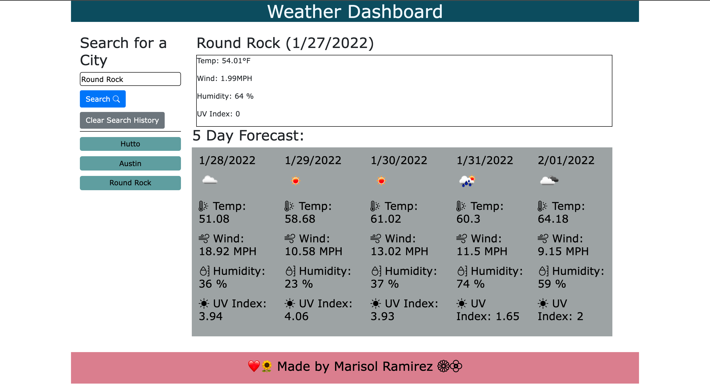

# WeatherDashboard

## Description
This app allows you to see the weather outlook for multiple cities so that you may plan trips accordingly. You can search a city, then when you go to search another city the previous one is saved so that you may go back and look at it if needed.

## Built with
* HTML
* CSS 
* JavaScript
* moment.js

## Links 🔗 
* Deployed application at [GitHub](https://github.com/MarisolRamirez1031/WeatherDashboard)

## License
 This project is covered by the [MIT](https://choosealicense.com/) license.

## Credits
* [OpenWeather](https://openweathermap.org/) One Call API
* [moment.js](https://cdnjs.com/libraries/moment.js)

## Visual

 
